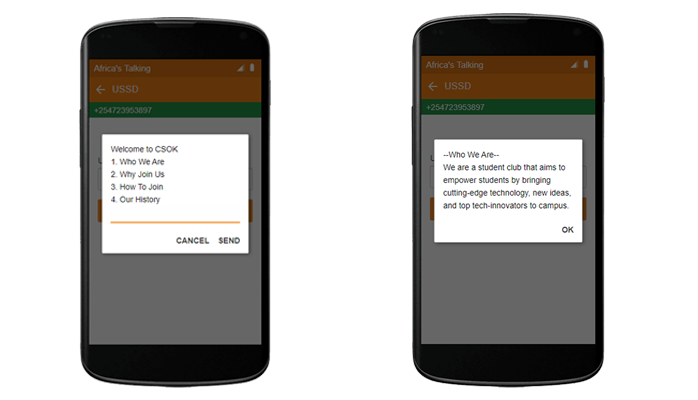

# USSD_Service
USSD App with information about Computer Society of Kimathi
The app is built with Nodejs

## Demo

## Contributing
Please read [Contributing.md](CONTRIBUTING.md) for  details on our code of conduct, and the process for submitting pull requests to us.

## License
This project is licensed under the [MIT License](LICENCE.md) - see the LICENSE.md file for details